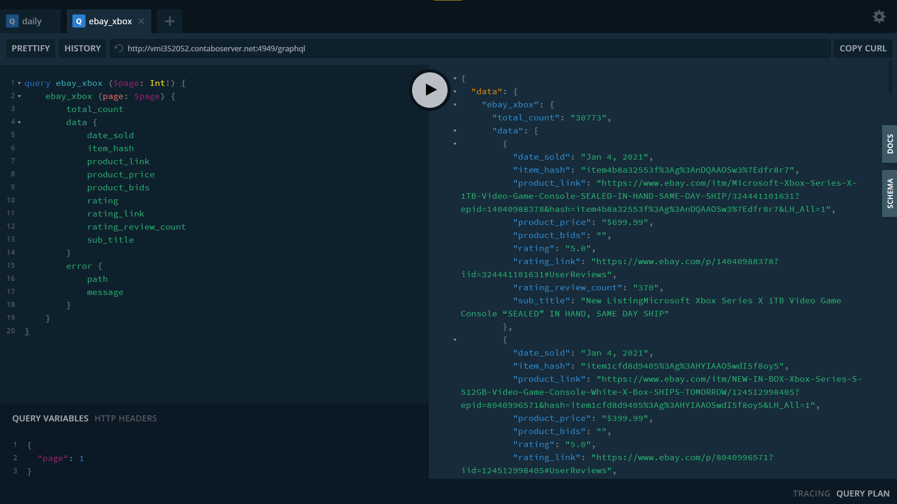

<br />
<p align="center">
  <a href="https://github.com/rasheeddavid/ebay-scrape">
    
  </a>

  <h3 align="center">Ebay Autonomous Scrapping</h3>

  <p align="center">
    A puppeteer bot to collect completed sales information for the playstation 5 & xbox series x next gen.consoles
    <br />
    <a href="https://documenter.getpostman.com/view/10077490/TVt2e4h4"><strong>Explore the API docs »</strong></a>
    <br />
    <br />
    <a href="http://vmi352052.contaboserver.net:4949/graphql">View Demo (GQL playground)</a>
    ·
    <a href="https://github.com/rasheeddavid/ebay-scrape/issues">Report Bug</a>
    ·
    <a href="https://github.com/rasheeddavid/ebay-scrape/issues">Request Feature</a>
  </p>

<!-- TABLE OF CONTENTS -->
<details open="open">
  <summary>Table of Contents</summary>
  <ol>
    <li>
      <a href="#about-the-project">About The Project</a>
      <ul>
        <li><a href="#built-with">Built With</a></li>
      </ul>
    </li>
    <li>
      <a href="#getting-started">Getting Started</a>
      <ul>
        <li><a href="#prerequisites">Prerequisites</a></li>
        <li><a href="#installation">Installation</a></li>
      </ul>
    </li>
    <li><a href="#usage">Usage</a></li>
  </ol>
</details>

<!-- ABOUT THE PROJECT -->

## About The Project

[![Product Name Screen Shot][product-screenshot]](http://vmi352052.contaboserver.net:4949/graphql)

[A simple bot](src/Services/bot/index.ts) to extract(every 45 mins) and store the latest completed sales infomration on the next-gen consoles **playstation 5** & **xbox series-x** run in scalable containers

### Built With

-   [TypeScript]()
-   [Nodejs]()
-   [GraphQl]()
-   [Docker]()
-   [MySQL]()
-   [Redis]()

<!-- GETTING STARTED -->

## Getting Started

To set up project locally, please note that a demo project has been hosted on [here](http://vmi352052.contaboserver.net:4949/graphql)

### Prerequisites

-   [docker](https://www.docker.com/get-started)
-   [docker-compose](https://docs.docker.com/compose/install/)

### Installation

1. Clone the repo
    ```sh
    git clone https://github.com/rasheeddavid/ebay-scrape
    ```
2. Cd into root directory
    ```sh
    cd ebay-scrape
    ```
3. Run docker-compose
    ```sh
    docker-compose up -d
    ```

<!-- USAGE EXAMPLES -->

## Usage (Queries)

**get**

Retrieve paginated data collected by bot filtered by console & date, sorted by most recent

[![get_demo][product-screenshot]](http://vmi352052.contaboserver.net:4949/graphql)

**daily**

Retrieve paginated completed sales for the current date, updated every 45mins


**get - from source**

Retrieve paginated data(25/page) directly from source, sorted by most recent



**real time updates - from updates**

Retrieve data from source in real time (scheduled to run every 10 minutes to avoid a ban). Runs in websockets & graphql subscriptions


Project Structure
============================

> Where find stuff 🔍

### directory layout
    .
    ├── build                       # Compiled files (javascript source files)
    ├── docker                      # Dockerfile(s)
    ├── src                         # Source files
      ├── Database            # DB entity objects & migrations
      ├── GraphQL             # Resolvers & Schemas
      ├── Services
          ├── bot                # Handle data collection
          ├── cron               # Scheduling data collection
          ├── ebay.scrappr       # Handle Scrappping ebay
          └── scrapped.data      # Handle Queries (bot-DB-interation)
      ├── Utils               # Utilities
      ├── apollo.server.ts    # Application entry
      └── index.ts
    ├── ormconfig.json              # Type-Orm configurations
    └── README.md
    

[product-screenshot]: images/get.png
